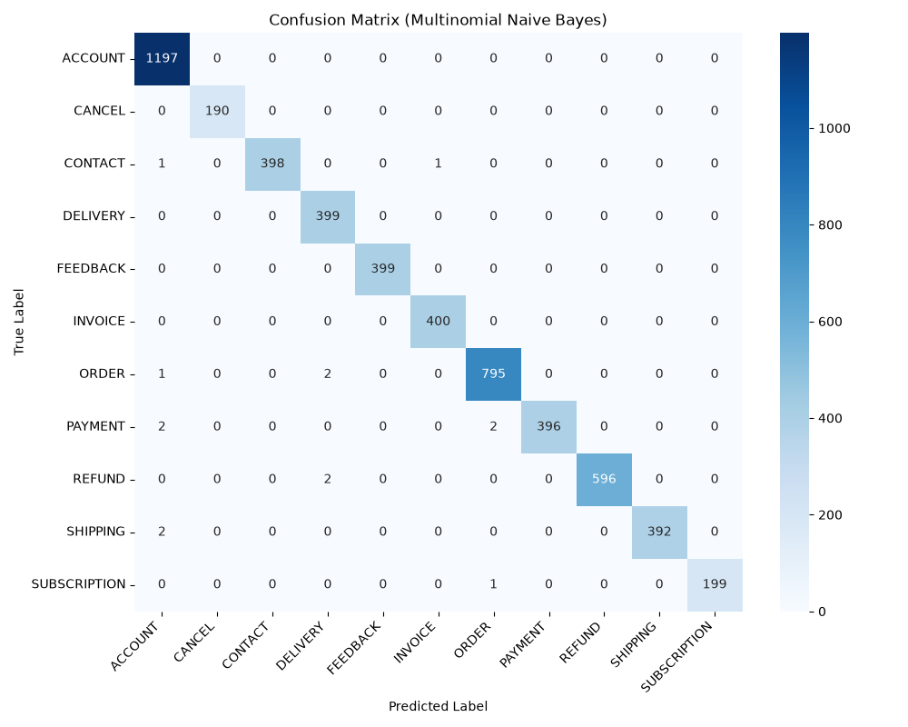

# E-Commerce Customer Complaint Classifier

Automated e-commerce customer complaint classification to enable faster support ticket routing. This system ingests customer support tickets (text), applies a reproducible NLP preprocessing pipeline, and classifies them into categories (e.g., Order, Refund, Shipping) with a confidence score.

## Dataset

- **Source**: Hugging Face dataset (`bitext/Bitext-customer-support-llm-chatbot-training-dataset`)
- **Size**: ~26,800 tickets
- **Categories**: ACCOUNT, ORDER, REFUND, INVOICE, CONTACT, PAYMENT, FEEDBACK, DELIVERY, SHIPPING, SUBSCRIPTION, CANCEL
- **Features used**: `instruction` (complaint text) → cleaned and TF-IDF vectorized
- **Target**: `category` (encoded into multi-class labels)

## NLP Pipeline

1. Lowercase, strip URLs, punctuation, special characters
2. NLTK tokenization + stopword removal
3. TF-IDF vectorization — unigrams + bigrams, `max_features=8000`, `sublinear_tf=True`

## Model Comparison (Macro-Averaged)

| Model                   | Accuracy | Precision | Recall | F1     |
|-------------------------|----------|-----------|--------|--------|
| Logistic Regression     | 0.9967   | 0.9980    | 0.9955 | 0.9968 |
| Multinomial Naive Bayes | **0.9974** | **0.9981** | **0.9971** | **0.9976** |
| XGBoost                 | 0.9929   | 0.9950    | 0.9911 | 0.9930 |

> _Metrics will be updated after training completes._

## Confusion Matrix



## Setup & Run Locally

```bash
# 1. Activate the virtual environment
source venv/bin/activate

# 2. Train models (saves model.pkl, vectorizer.pkl, label_encoder.pkl, lr_model.pkl, confusion_matrix.png)
python train.py

# 3. Start the Flask inference app
python app.py
```
Then open [http://127.0.0.1:5001](http://127.0.0.1:5001) and paste any customer complaint.

## Run via Docker

```bash
# Build the image
docker build -t ecom-classifier .

# Run the container
docker run -p 5001:5001 ecom-classifier
```
Then open [http://localhost:5001](http://localhost:5001).
